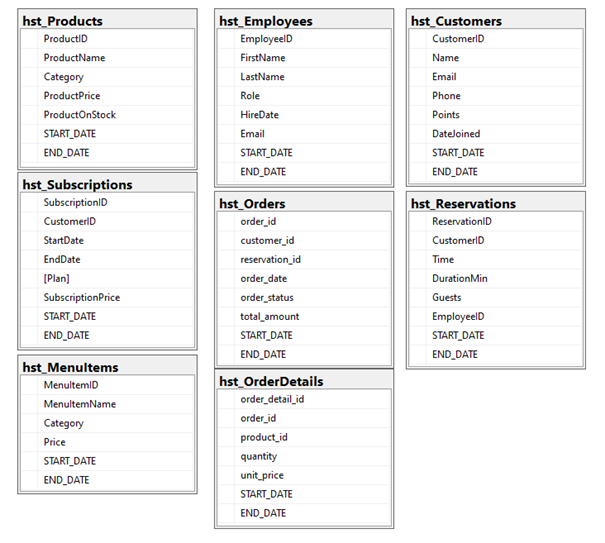
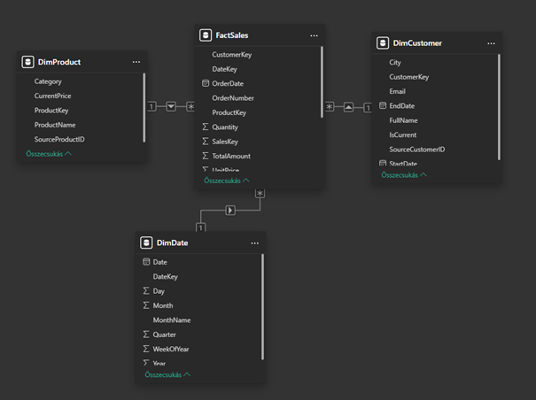
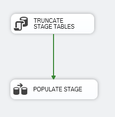
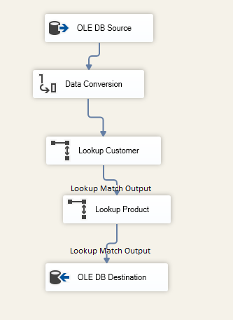
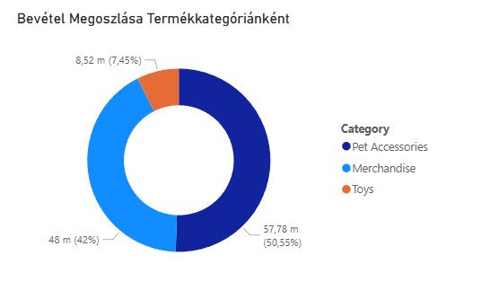

# Global Supply Chain & Sustainability BI Solution

**End-to-end Enterprise Data Warehouse (DWH) solution: Python data telemetry, SSIS ETL pipeline (SCD Type 2), SQL Server storage, and Power BI Analytics for Lifecycle Assessment (LCA).**

## 🚀 Project Overview
This project demonstrates a comprehensive Business Intelligence solution designed for a global manufacturing and supply chain network. It simulates real-time monitoring of factory emissions, material usage, and logistics efficiency.

The pipeline covers the entire data lifecycle:
1.  **Data Generation:** Synthetic telemetry simulating global factory nodes.
2.  **Data Warehousing:** A three-layer architecture (Stage, History, Data Mart).
3.  **ETL Orchestration:** Complex data transformation using SSIS.
4.  **Analytics:** Lifecycle Assessment (LCA) dashboarding.

---

## 🛠️ Technical Stack
*   **Data Generation:** Python (`Faker` library) - Simulating IoT sensor data & logistics logs.
*   **Database Engine:** Microsoft SQL Server (2019+).
*   **ETL Orchestration:** Microsoft SSIS (SQL Server Integration Services).
*   **Data Modeling:** Dimensional Modeling (Star Schema) & SCD Type 2.
*   **BI & Analytics:** Microsoft Power BI (DAX).

---

## 📊 1. Data Source & Modeling (Python)
The foundation is a Python-based telemetry engine that generates relational data simulating a global supply chain. Unlike static datasets, this script generates dynamic relationships between factories, materials, and energy consumption.

**Source Database Entities:**
*   **Factories:** Metadata about manufacturing locations.
*   **Materials:** Raw materials with specific carbon emission factors.
*   **Logistics:** Shipping routes and transport modes.
*   **Emission Logs:** Transactional data recording energy usage and CO2 output.

---

## 🏗️ 2. Data Warehouse Architecture
The solution follows a classic **Three-Tier Architecture** to ensure high data quality, historical tracking, and query performance:

### A. STAGE Layer (Landing Zone)
*   **Purpose:** Raw data ingestion.
*   **Design:** All fields are handled as `strings` (varchar) with no constraints.
*   **Logic:** `TRUNCATE` + `INSERT` strategy for high-speed batch loading.

### B. HST (History) Layer - Core DWH
*   **Purpose:** Data type enforcement and historical tracking.
*   **Design:** Implements **Slowly Changing Dimensions (SCD Type 2)**.
*   **Logic:** Every dimension table tracks changes (e.g., if a factory changes its energy source) using `START_DATE`, `END_DATE`, and `IS_CURRENT` flags. This ensures a perfect audit trail for LCA reporting.

### C. DM (Data Mart) Layer - Analytics
*   **Purpose:** Optimized for BI reporting.
*   **Design:** **Star Schema**.
*   **Fact Table:** `FactEmissions` (Contains measures: Energy usage, CO2 output).
*   **Dimensions:** `DimMaterial`, `DimFactory`, `DimLogistics`, `DimDate`.

---

## 🔄 3. ETL Pipeline (SSIS Orchestration)
The integration logic is managed by **SQL Server Integration Services (SSIS)** packages.

### Extract & Load Phase
*   **Control Flow:** An `Execute SQL Task` performs a `TRUNCATE` on STAGE tables before each run.
*   **Data Flow:** Extracts fresh telemetry from the Python-generated source and loads it into the Staging area.

### Transformation Phase (SCD Logic)
*   **Historization:** Managed via **SCD Wizard** or custom Merge logic to handle historical updates.
*   **Surrogate Keys:** Uses **Lookup Transformations** to map business keys to technical Surrogate Keys, isolating the DWH from source system changes.

---

## 📈 4. Power BI Sustainability Analytics
The final dashboard provides critical insights for **LCA (Lifecycle Assessment)** practitioners:

*   **Carbon Footprint Trends:** Quarterly analysis of CO2 emissions across different manufacturing regions.
*   **Material Efficiency:** Identifying high-impact materials and suggesting sustainable alternatives based on historical data.
*   **Operational KPIs:**
    *   **Total Carbon Footprint (kg CO2e)**
    *   **Energy Intensity (kWh/Unit)**
    *   **Material Circularity Score**

---

## ⚙️ Setup & Execution

1.  **Database Initialization:**
    *   Run scripts in `/sql/01_create_source.sql` to setup the operational DB.
    *   Run `/sql/02_create_dwh.sql` to setup Stage, History, and Data Mart schemas.
2.  **Data Generation:**
    *   Execute `python scripts/data_generator.py` to populate the source system.
3.  **ETL Execution:**
    *   Open the SSIS project in Visual Studio.
    *   Configure `Connection Managers` for your local SQL Server instance.
    *   Execute the `Master_Package.dtsx` to trigger the full ETL cycle.
4.  **Analysis:**
    *   Open `reports/Sustainability_Dashboard.pbix` to explore the data.
